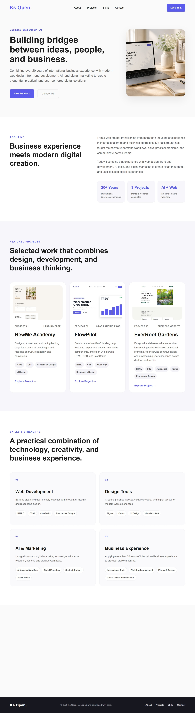

# 🌐 Ks Open.

A responsive web and digital portfolio showcasing selected projects,
practical business experience, and a growing skill set in modern digital creation.

## 👋 About the Portfolio

Ks Open. brings together web design, front-end development, AI-assisted
workflows, digital marketing, and more than 20 years of international
business experience.

This portfolio was designed and developed from scratch with a focus on
clarity, usability, responsive design, and practical business thinking.

## 💼 Featured Projects

### NewMe Academy
A conversion-focused landing page concept for an online learning service,
designed with a calm, modern visual style and responsive user experience.

### FlowPilot
A modern SaaS website and dashboard concept focused on clear information
architecture, usability, and responsive UI design.

### EverRoot Gardens
A small-business website concept designed around approachable branding,
clear services, and customer communication.

## 🛠️ Skills & Tools

- HTML5
- CSS3
- JavaScript
- Responsive Web Design
- Figma
- Git & GitHub
- AI-assisted workflows
- Digital Marketing

## 🚀 Live Portfolio

[View the live Ks Open. portfolio](https://moimoinene-gugu.github.io/portfolio-03-myportfolio/)

## ✉️ Contact

**Ks Open.**  
Web · Digital · Business  
hello.ksopen@gmail.com